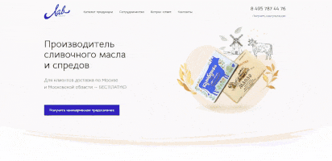

<h1><a href='https://lavproduct.netlify.app'>LavProduct web site</a></h1>
 

 

## LavProduct - Веб-сайт с адаптивным дизайном, интерактивностью и SEO-оптимизацией

Проект "LavProduct" - это одностраничный веб-сайт с динамическим макетом, закрепленными заголовками, анимациями и
адаптивным дизайном. Он адаптирован под работу на всех устройствах благодаря своему адаптивному дизайну. Модальные окна
для перехода на страницу продукта, где также реализован слайдер для просмотра других товаров.

В проекте использованы библиотеки `hoverintent` и `focusTrap`, обеспечивающие более удобное взаимодействие и навигацию
для пользователей. Кроме того, сайт прошел SEO-оптимизацию, что способствует его более высокой видимости в поисковых
системах.

- **Адаптивный дизайн**: Сайт разработан с акцентом на адаптивность, обеспечивая идеальное отображение на всех типах
  устройств, от компьютеров до мобильных устройств.

- **Динамический макет**: Используется динамический макет с закрепленными заголовками, что обеспечивает более удобную
  навигацию по сайту.

- **Анимации**: Добавлены анимации, которые придают сайту интерактивный и привлекательный вид.

- **Модальные окна и слайдер**: Реализованы модальные окна для перехода на страницы продуктов, где также доступен
  слайдер для просмотра других товаров.

Посетите наш сайт, чтобы узнать больше о нашей продукции и интерактивных функциях, учитывая его высокую SEO-оптимизацию
и адаптивный дизайн.

Сайт использует следующие библиотеки:

- [Glide.js](https://glidejs.com/): Версия 3.4.1
- [Axios](https://github.com/axios/axios): Версия 0.21.4
- [Custom Select](ссылка-на-репозиторий-custom-select): Версия 1.1.15
- [Focus Trap](https://github.com/davidtheclark/focus-trap): Версия 6.7.1
- [HoverIntent](https://github.com/briancherne/jquery-hoverIntent): Версия 2.2.1
- [Swiper](https://swiperjs.com/): Версия 7.0.1

## License

Distributed under the `MIT` License. See [LICENSE](https://github.com/kluevevga/lavProduct/blob/master/LICENSE) for more
information.

